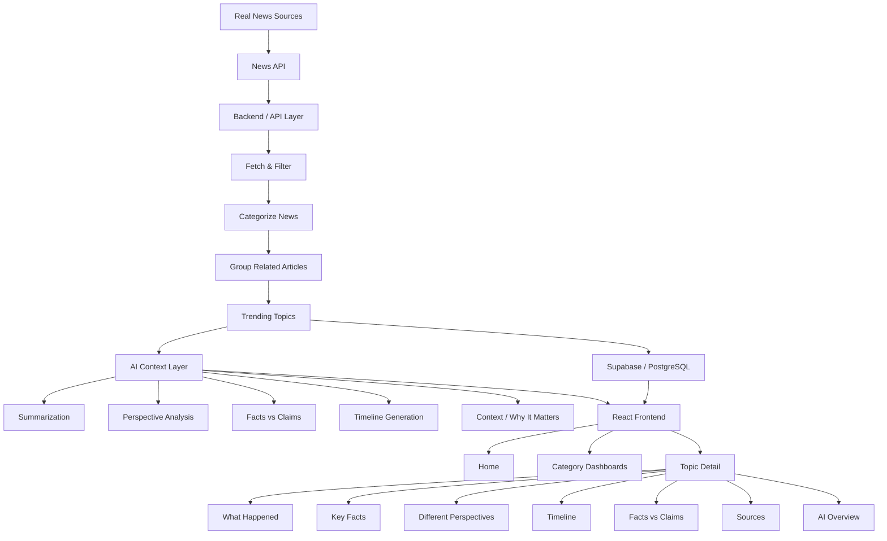
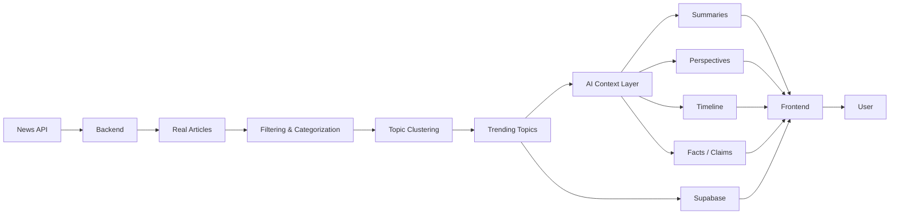
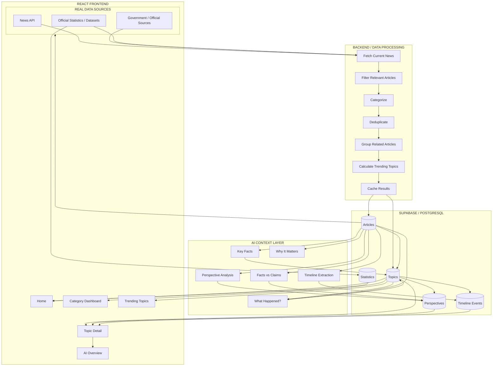
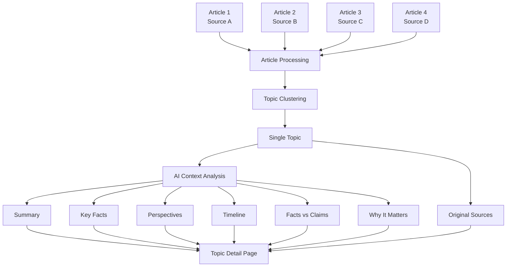
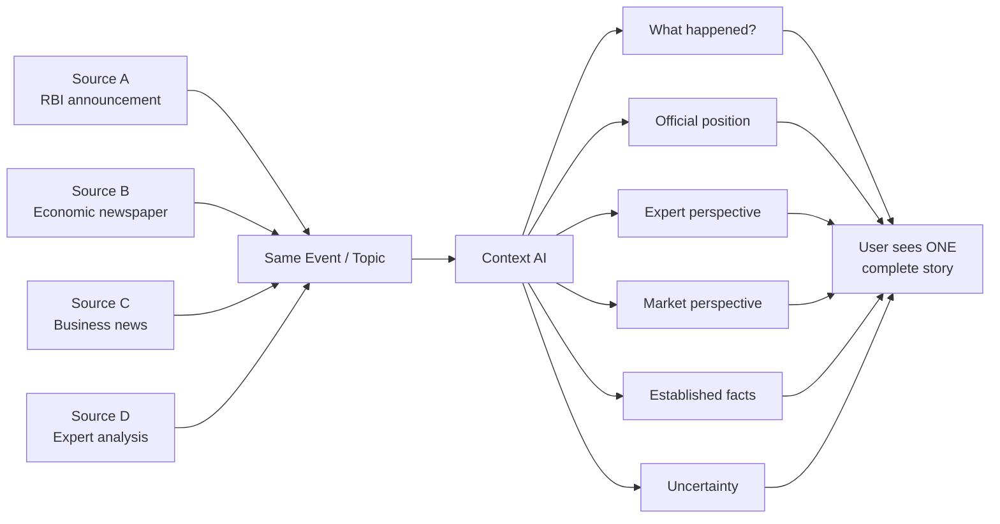
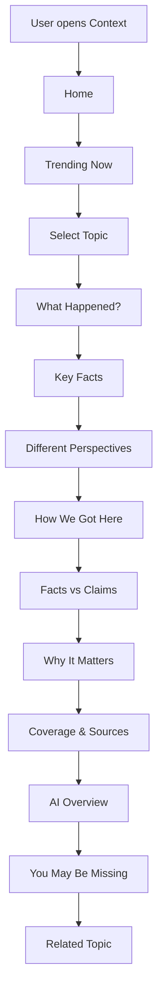
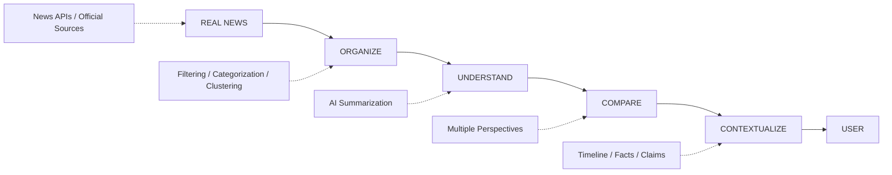

# Context — System Architecture

## 1. High-Level Architecture

---

## 2. Simplified Data Flow

---

# 3. Detailed Architecture

---

# 4. Topic-Level Data Flow

The most important part of Context is the flow from **multiple articles → one understandable story**.

---

# 5. Example

For example, suppose multiple sources report on the same RBI announcement:

---

# 6. Core Product Flow

---

# 7. Architecture Principle

**Core principle:**

> **Real news provides the information. AI provides the context.**

AI should never become the source of truth. It should operate on retrieved source material and clearly communicate uncertainty or disagreement.
